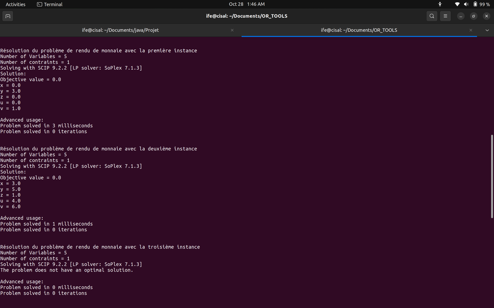
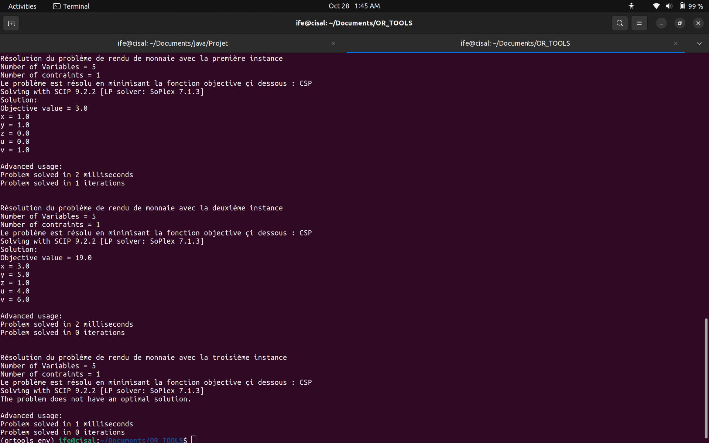

# Problème de Rendu de Monnaie dans un Distributeur Automatique  
## Modélisation par Programmation par Contraintes (CP) avec OR-Tools

---

## 1. Description du Problème

Un utilisateur insère un montant total **T** (en FCFA) dans un distributeur de boissons.  
Il sélectionne une boisson de prix **P** (en FCFA).  
Le distributeur doit rendre la **monnaie exacte** :  
> **R = T − P**

Le distributeur dispose d’un **stock limité** de pièces :

| Valeur (FCFA) | Quantité disponible | Variable |
|---------------|---------------------|---------|
| 200           | `E2`                | `x`  |
| 100           | `E1`                | `y`  |
| 50            | `C50`               | `z`   |
| 25            | `C25`               | `u`   |
| 10            | `C10`               | `v`   |

---

## 2. Objectifs

1. **Rendre exactement R** avec les pièces disponibles  
2. **Minimiser le nombre total de pièces rendues** (optimisation)

---

## 3. Modèle de Programmation par Contraintes (CP)
Pour chacun des modèles proposés , nous avons proposé un modèle de programmation de contraintes avec et sans fonction objective pour trouver une solution.

### Variables et Domaines  de décision
```python
x ∈ [0, E2]   # Le nombre pièces de 200 FCFA
y ∈ [0, E1]   # Le nombre pièces de 100 FCFA
z  ∈ [0, C50]  # Le nombre pièces de 50 FCFA
u  ∈ [0, C25]  # Le nombre pièces de 25 FCFA
v  ∈ [0, C10]  # Le nombre pièces de 10 FCFA
```

### Contraintes 
> 200*x + 100*y + 50*z + 25*u + 10*v = R

### Fonction Objective 
Dans le but de minimiser le nombre de pièces à retourner , nous avons utiliser la fonction objective çi après : 
> **Minimiser** : x + y + z + u + v

## 4. Instances de Tests 
| Instance | T   | P   | R   | E2 | E1 | C50 | C25 | C10 |
|----------|-----|-----|-----|----|----|-----|-----|-----|
| I1       | 1000| 690 | 310 | 3  | 5  | 5   | 5   | 10  |
| I2       | 2000| 690 |1310 | 3  | 5  | 1   | 5   | 10  |
| I3       | 1000| 695 | 305 | 3  | 5  | 5   | 0   | 10  |

## 6. Code Python 
```python
from ortools.linear_solver import pywraplp

I1 = {'T':1000,'P':690,'E2':3,'E1':5,'C50':5,'C25':5,'C10':10}
I2 = {'T':2000,'P':690,'E2':3,'E1':5,'C50':1,'C25':5,'C10':10}
I3 = {'T':1000,'P':695,'E2':3,'E1':5,'C50':5,'C25':0,'C10':10}

def problemeRenduMonnaie(a,mode='COP'):

    if (a == I1):
        print("\n\nRésolution du problème de rendu de monnaie avec la première instance")
    elif (a == I2):
        print("\n\nRésolution du problème de rendu de monnaie avec la deuxième instance")
    elif (a == I3):
        print("\n\nRésolution du problème de rendu de monnaie avec la troisième instance")
    else:
        print("\n\nVous n'avez pas bien entrer le paremètre")


    #Définition du solver
    solver = pywraplp.Solver.CreateSolver("SCIP")
    if not solver:
        return
    
    #Définition des variables
    infinity = solver.infinity()
    x = solver.IntVar(0,a['E2'],'x')
    y = solver.IntVar(0,a['E1'],'y')
    z = solver.IntVar(0,a['C50'],'z')
    u = solver.IntVar(0,a['C25'],'u')
    v = solver.IntVar(0,a['C10'],'v')

    #Afficher le nombre de Variables
    print("Number of Variables =" , solver.NumVariables())

    #Définition des contraintes
    solver.Add( x*200 + y*100 + z*50 + u*25 + v*10 == a['T'] - a['P'] )

    #Affichage du nombre de contraintes 
    print("Number of contraints =" , solver.NumConstraints())

    if (mode == 'CSP'):
        #Objective function 
        print("Le problème est résolu en minimisant la fonction objective çi dessous : CSP")
        solver.Minimize( x + y + z + u +v)
    else:
        pass

    # Résolution du problème en appellant le solver
    print(f"Solving with {solver.SolverVersion()}")
    status = solver.Solve()


    if status == pywraplp.Solver.OPTIMAL:
        print("Solution:")
        print(f"Objective value = {solver.Objective().Value():0.1f}")
        print(f"x = {x.solution_value():0.1f}")
        print(f"y = {y.solution_value():0.1f}")
        print(f"z = {z.solution_value():0.1f}")
        print(f"u = {u.solution_value():0.1f}")
        print(f"v = {v.solution_value():0.1f}")
    else:
        print("The problem does not have an optimal solution.")

    print("\nAdvanced usage:")
    print(f"Problem solved in {solver.wall_time():d} milliseconds")
    print(f"Problem solved in {solver.iterations():d} iterations")


problemeRenduMonnaie(I1)
problemeRenduMonnaie(I2)
problemeRenduMonnaie(I3)

problemeRenduMonnaie(I1,'CSP')
problemeRenduMonnaie(I2,'CSP')
problemeRenduMonnaie(I3,'CSP')

```

## 6. Résultat de la compilation

### 6.1 COP


### 6.2 CSP



## 7. Résultat obtenu sans la fonction objective : COP
| Instance | Solution | Pièces | Détail |
|----------|----------|--------|-------|
| **I1**   | Oui   | **4**  | 3×100 + 1×10 |
| **I2**   | Oui   | **19**    | 3x200 + 5x100 + 1x50 + 4x25 + 6x10 |
| **I3**   | Non   | –– | Stock Insuffisant|

## 8. Résultat obtenu avec la fonction objective : CSP
| Instance | Solution | Pièces | Détail |
|----------|----------|--------|-------|
| **I1**   | Oui   | **3**  | 1×200 + 2x100 1×10 |
| **I2**   | Oui   | **19**    | 3x200 + 5x100 + 1x50 + 4x25 + 6x10 |
| **I3**   | Non   | –– | Stock Insuffisant|

## 9. Interpretation des résultats obtenus

Dans le premier cas où nous avons fait sans la fonction objectives , les Instances 1 et 3 ont données des solutions mais pas la deuxième , en raison de la pièce de 5fr manquante. Le même problème s'est posé en résolvant le problème avec l fonction objective.
Ce qui explique le fait qu'on ne puisse de trouver de solution pour la troisième instance.
Remarquons également que pour la deuxième instance , la solution optimale n'a pas changée avec ou sans fonction objective.Bien sûr , on aurait pu trouver mieux , mais les nombres de pièces disponibles ne le permettent pas.

## Auteur
**COMLAN Ifè Léonce**
**GIT-4 / RT-4**
