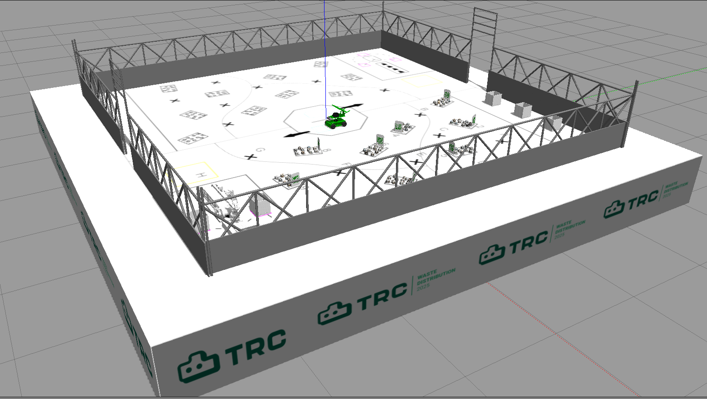

# TRC 2025 ROS Ressources

This repository contains a simulator and a set of useful sensors drivers under ROS2 humble and Gazebo Classic.

Clone the repository and compile the contained packages using the configure script.
This will create and build a workspace `trc_ws` and move to it root (it also manages sourcing).

```bash
cd 2025-ROS-Ressources
source configure.sh
```

Run `sim_trc` (the TRC 2025 arena and the rosmaster X3 under Gazebo):

```bash
ros2 launch sim_trc sim_trc.launch.py
```


